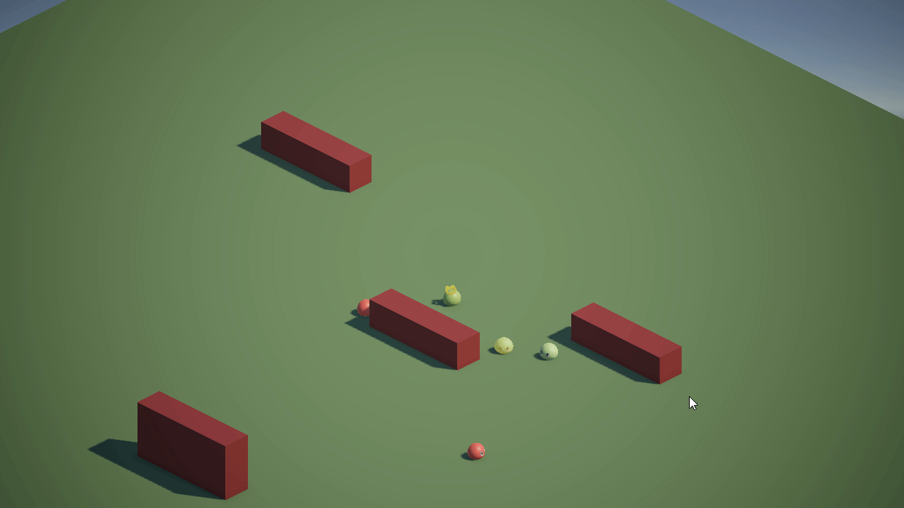

# SlimeTactics

Work in progress gameplay prototype of an auto-battler in Unity3D, with a focus on clean and modular code (as much as I can!). I'm also implementing the pathfinding system from scratch using a modified version of the A* algorithm to handle multiple agents simultaneously.

Game idea is that you play as the Slime King, a self-proclaimed monarch who is very weak on its own except the fact that he can eat weaker slimes. After eating a slime, he then can summon it whenever he wants in order to fight more powerful slimes, weaken them and eat them as well. You can choose to kill slimes or eat them. While killing them is safer on the short term since you can hide behind your slime army, you will need a more powerful slime army to take down powerful enemies later! 

## Current progress:

*The Slime King can order its army to attack enemies*
